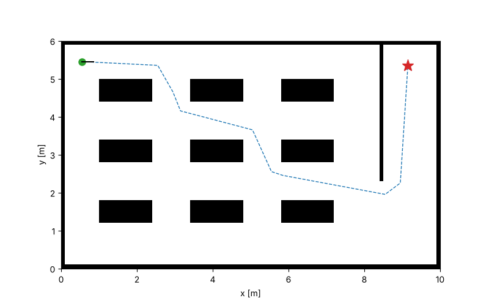

# navkit

[](https://github.com/yosefco1232ERNAME/navkit/actions/workflows/ci.yml)


A small, fully tested 2D navigation stack for differential-drive mobile robots, written from scratch in Python.
It covers the core pipeline every autonomous robot runs: **map → plan → track → simulate**.



```
$ navkit run maps/warehouse.txt --plot docs/demo.png
outcome=reached time=15.20s planned=11.59m driven=10.90m
A* expanded 1185 cells
```

## Features

| Module | What it does |
|---|---|
| `grid_map` | Immutable occupancy grid, world ↔ cell transforms, obstacle inflation by robot radius |
| `planning.astar` | 8-connected A* with octile heuristic, no corner cutting, search statistics |
| `robot` | Differential-drive kinematics with exact arc integration, speed limits that preserve curvature, acceleration limits |
| `control.pure_pursuit` | Pure Pursuit path tracking with goal slow-down and turn-in-place |
| `simulation` | Closed-loop runner reporting `reached / collision / timeout / no_path` |
| `viz`, `cli` | Plots, animated GIFs and a `navkit` command-line tool |

## Architecture

```
          ASCII map
              │
              ▼
      ┌───────────────┐   inflate(robot_radius)   ┌─────────────────┐
      │ OccupancyGrid │ ─────────────────────────▶│ Planner (A*)    │──▶ path: list[Point]
      └───────────────┘                           └─────────────────┘          │
              ▲                                                                ▼
              │ collision check     ┌────────────────────┐  Twist(v, ω)  ┌────────────────────┐
              └──────────────────── │ DifferentialDrive  │ ◀──────────── │ PurePursuit        │
                                    │ Robot (kinematics) │ ─── Pose ───▶ │ Controller         │
                                    └────────────────────┘               └────────────────────┘
```

Design decisions:

- **Planners share a `Planner` protocol**, so adding Dijkstra, Theta* or RRT does not touch the simulator.
- **Plan on an inflated grid, check collisions on the real one.** This lets the planner treat the robot as a point.
- **Speed saturation scales `v` and `ω` together**, so a clamped command still follows the same arc.
- **Grids are immutable** (read-only numpy arrays), which avoids a whole class of aliasing bugs.

## Quick start

```bash
git clone https://github.com/yosefco1232ERNAME/navkit.git
cd navkit
python -m venv .venv && source .venv/bin/activate
pip install -e ".[dev]"

navkit run maps/warehouse.txt --plot out.png --gif out.gif
```

Write your own map with `#` for obstacles, `.` for free space, `S` for start and `G` for goal.

## Development

```bash
pytest --cov          # 37 tests, ~97% coverage
ruff check . && ruff format --check .
mypy                  # strict mode
```

CI runs all of the above on Python 3.11–3.13 for every push and pull request.

Notable tests:

- `test_matches_dijkstra_on_random_maps` checks A* against uniform-cost search on 20 random maps: same optimal cost, never more expansions.
- `test_integrate_half_circle` checks the kinematic model against the closed-form solution.
- `test_warehouse_end_to_end` runs the full pipeline and asserts the robot never enters an obstacle.


## License

MIT
