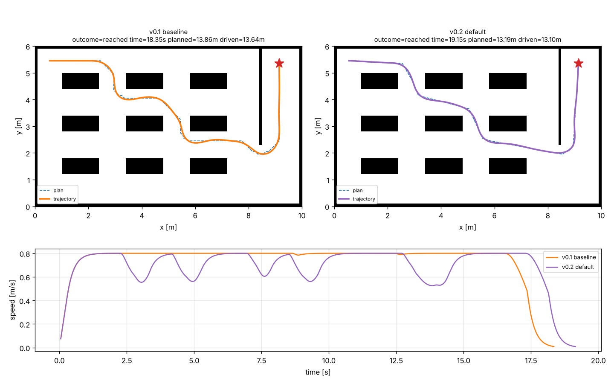

# navkit

[](https://github.com/yosefco1232/navkit/actions/workflows/ci.yml)


A small, fully tested 2D navigation stack for differential-drive mobile robots, written from scratch in Python.
It covers the core pipeline every autonomous robot runs: **map → plan → track → simulate**.


```
$ navkit compare maps/warehouse.txt --plot docs/compare.png
```

| config | time [s] | planned [m] | RMS CTE [cm] | max CTE [cm] | min clearance [cm] | peak lat. accel [m/s²] |
|---|---|---|---|---|---|---|
| v0.1 baseline | 18.35 | 13.86 | 2.9 | 7.6 | 26.6 | 1.41 |
| **v0.2 default** | 19.15 | **13.19** | **2.1** | **6.1** | **28.1** | **0.60** |

v0.2 drives a 5% shorter path, tracks it 20–28% more accurately and cuts peak lateral
acceleration by 57% (to the configured 0.6 m/s² limit), for 0.8 s (4%) more travel time.
CTE = cross-track error, the distance between the robot and the planned path.
Simulated with a 0.25 s first-order motor lag.



## Features

| Module | What it does |
|---|---|
| `grid_map` | Immutable occupancy grid, world ↔ cell transforms, obstacle inflation by robot radius |
| `planning.astar` | 8-connected A* with octile heuristic, no corner cutting, search statistics |
| `planning.smoothing` | Line-of-sight shortcutting (Bresenham) as a `SmoothedPlanner` decorator, path resampling |
| `robot` | Differential-drive kinematics with exact arc integration, curvature-preserving speed limits, acceleration limits, first-order motor lag |
| `control.pure_pursuit` | Pure Pursuit with speed-adaptive lookahead and exact circle–path intersection |
| `control.velocity_profile` | Curvature-constrained speed profile with a backward braking pass, so the robot slows *before* corners |
| `simulation` | Closed-loop runner with footprint collision checking; `reached` requires the robot to be stopped |
| `metrics` | Cross-track error, obstacle clearance and lateral acceleration, all vectorized with numpy |
| `viz`, `cli` | Plots, comparison charts, animated GIFs, `navkit run` and `navkit compare` |

## Architecture

```
          ASCII map
              │
              ▼
      ┌───────────────┐   inflate(robot_radius)   ┌─────────────────┐
      │ OccupancyGrid │ ─────────────────────────▶│ Planner (A*)    │──▶ path: list[Point]
      └───────────────┘                           └─────────────────┘          │
              ▲                                                                ▼
              │ collision check     ┌────────────────────┐  Twist(v, ω)  ┌────────────────────┐
              └──────────────────── │ DifferentialDrive  │ ◀──────────── │ PurePursuit        │
                                    │ Robot (kinematics) │ ─── Pose ───▶ │ Controller         │
                                    └────────────────────┘               └────────────────────┘
```

Design decisions:

- **Planners share a `Planner` protocol**, so adding Dijkstra, Theta* or RRT does not touch the simulator.
- **Plan with a safety margin, check collisions against the real footprint.** Obstacles are inflated by
  robot radius + margin for planning; the margin is the room the controller has to deviate.
- **Speed saturation scales `v` and `ω` together**, so a clamped command still follows the same arc.
- **Grids are immutable** (read-only numpy arrays), which avoids a whole class of aliasing bugs.
- **Measure, then tune.** Every controller change is judged by `navkit compare`, and the result is locked
  in by a regression test (`test_v02_is_gentler_and_more_accurate_than_baseline`).

## What the metrics caught

Adding measurements in v0.2 surfaced problems that the v0.1 tests passed right over:

1. **Footprint collisions.** v0.1 only checked the robot's *center* against obstacles. Minimum clearance
   was 12.7 cm for a 20 cm-radius robot, so its body was scraping the shelves.
2. **Adaptive lookahead looked useless.** In a sim with instant motor response, a short fixed lookahead won on
   every metric. Adding a realistic motor lag made short lookaheads oscillate, which reproduced the textbook
   trade-off. Lesson: a controller is only as good as the plant model it is tuned on.
3. **A floating-point off-by-one.** `ceil((0.2 + 0.1) / 0.1)` is 4, not 3, so the safety inflation was
   silently one cell too large. Now fixed and pinned by a test.
4. **"Reached" at full speed.** The sim used to stop as soon as the robot entered the goal radius, at 0.65 m/s.
   It now requires a full stop, which revealed 1.3 s of braking that the baseline time had been hiding.

## Quick start

```bash
git clone https://github.com/yosefco1232/navkit.git
cd navkit
python -m venv .venv && source .venv/bin/activate
pip install -e ".[dev]"

navkit run maps/warehouse.txt --plot out.png --gif out.gif
navkit compare maps/warehouse.txt --plot compare.png
```

Write your own map with `#` for obstacles, `.` for free space, `S` for start and `G` for goal.

The files in `src/navkit/` are library modules, not scripts. Install the package first (`pip install -e .`),
then use the `navkit` command (or `python -m navkit`), the tests, or the scripts in `examples/`:

```bash
python examples/robot_demo.py   # the robot model on its own: a circle, with and without motor lag
```

## Development

```bash
pytest --cov          # 65 tests, ~97% coverage
ruff check . && ruff format --check .
mypy                  # strict mode
```

CI runs all of the above on Python 3.11–3.13 for every push and pull request.

Notable tests:

- `test_matches_dijkstra_on_random_maps` checks A* against uniform-cost search on 20 random maps: same optimal cost, never more expansions.
- `test_integrate_half_circle` checks the kinematic model against the closed-form solution.
- `test_warehouse_end_to_end` runs the full pipeline and asserts the robot never enters an obstacle.


## License

MIT
